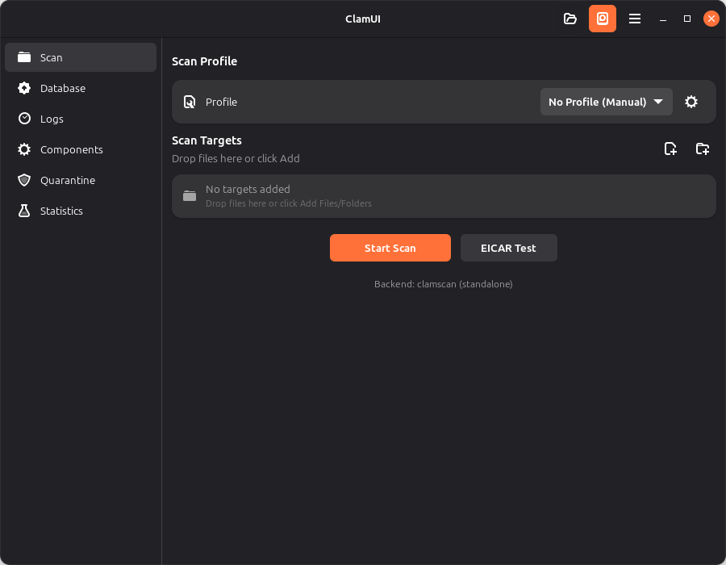
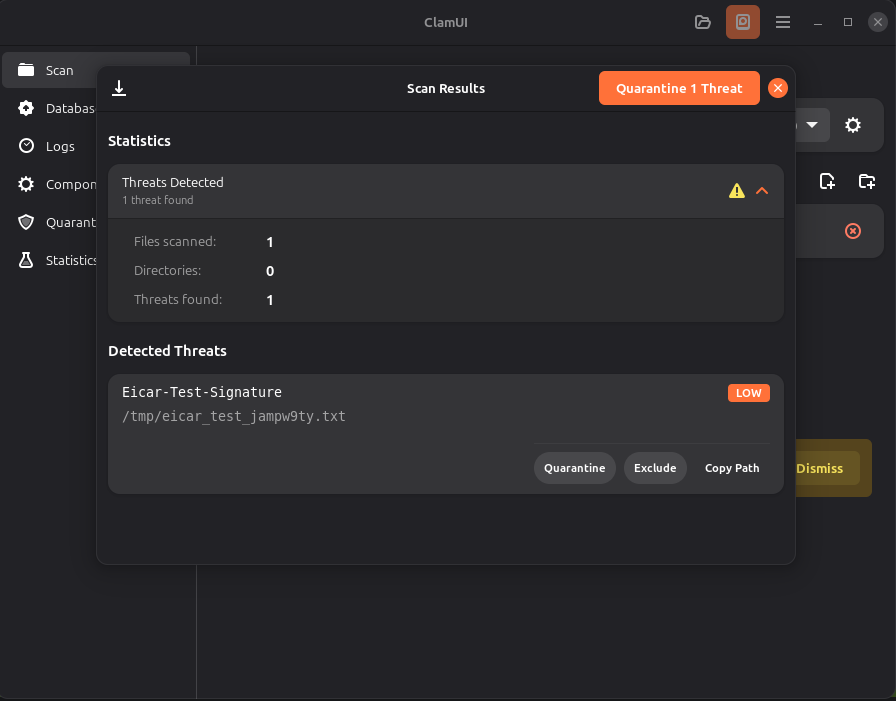

# ClamUI User Guide

Welcome to ClamUI! This guide will help you get the most out of your antivirus protection on Linux.

## What is ClamUI?

ClamUI is a user-friendly desktop application that brings the powerful ClamAV antivirus engine to your Linux desktop with an intuitive graphical interface. No command-line knowledge required!

Whether you're downloading files, managing USB drives, or just want peace of mind about your system's security, ClamUI makes virus scanning simple and accessible.

## Who is this guide for?

This guide is written for Linux desktop users who want straightforward antivirus protection without dealing with terminal commands. If you've installed ClamUI via Flatpak, a .deb package, or any other method, you're in the right place!

You don't need to be a Linux expert or understand how ClamAV works under the hood. This guide focuses on **what you can do** with ClamUI, not how the code works.

## What you'll learn

This guide covers everything you need to know to use ClamUI effectively:

- **Getting started** - Launch the app and understand the interface
- **Scanning for threats** - Check files and folders for viruses
- **Managing detected threats** - Handle quarantined files safely
- **Automating protection** - Set up scheduled scans
- **Customizing your experience** - Configure settings to match your needs

## Table of Contents

### Getting Started
- [Launching ClamUI](#launching-clamui)
- [First-Time Setup](#first-time-setup)
- [Understanding the Main Window](#understanding-the-main-window)
- [Navigating Between Views](#navigating-between-views)
- [Your First Scan](#your-first-scan)
  - [Selecting Files and Folders](#selecting-files-and-folders)
  - [Understanding Scan Progress](#understanding-scan-progress)
  - [Interpreting Scan Results](#interpreting-scan-results)

### Scanning for Viruses
- [File and Folder Scanning](#file-and-folder-scanning)
- [Drag-and-Drop Scanning](#drag-and-drop-scanning)
- [Testing with the EICAR Test File](#testing-with-the-eicar-test-file)
- [Understanding Scan Progress](#understanding-scan-progress-1)
- [Reading Scan Results](#reading-scan-results)
- [Threat Severity Levels](#threat-severity-levels)

### Scan Profiles
- [What are Scan Profiles?](#what-are-scan-profiles)
- [Using Default Profiles](#using-default-profiles)
  - [Quick Scan](#quick-scan)
  - [Full Scan](#full-scan)
  - [Home Folder Scan](#home-folder-scan)
- [Creating Custom Profiles](#creating-custom-profiles)
- [Editing Existing Profiles](#editing-existing-profiles)
- [Managing Exclusions](#managing-exclusions)
- [Importing and Exporting Profiles](#importing-and-exporting-profiles)

### Quarantine Management
- [What is Quarantine?](#what-is-quarantine)
- [Viewing Quarantined Files](#viewing-quarantined-files)
- [Restoring Files from Quarantine](#restoring-files-from-quarantine)
- [Permanently Deleting Threats](#permanently-deleting-threats)
- [Clearing Old Quarantine Items](#clearing-old-quarantine-items)
- [Understanding Quarantine Storage](#understanding-quarantine-storage)

### Scan History
- [Viewing Past Scan Results](#viewing-past-scan-results)
- [Filtering Scan History](#filtering-scan-history)
- [Understanding Log Entries](#understanding-log-entries)
- [Exporting Scan Logs](#exporting-scan-logs)

### Scheduled Scans
- [Why Use Scheduled Scans?](#why-use-scheduled-scans)
- [Enabling Automatic Scanning](#enabling-automatic-scanning)
- [Choosing Scan Frequency](#choosing-scan-frequency)
- [Setting Scan Times](#setting-scan-times)
- [Configuring Scan Targets](#configuring-scan-targets)
- [Battery-Aware Scanning](#battery-aware-scanning)
- [Auto-Quarantine Options](#auto-quarantine-options)
- [Managing Scheduled Scans](#managing-scheduled-scans)

### Statistics Dashboard
- [Understanding Protection Status](#understanding-protection-status)
- [Viewing Scan Statistics](#viewing-scan-statistics)
- [Filtering by Timeframe](#filtering-by-timeframe)
- [Understanding Scan Activity Charts](#understanding-scan-activity-charts)
- [Quick Actions](#quick-actions)

### Settings and Preferences
- [Accessing Preferences](#accessing-preferences)
- [Scan Backend Options](#scan-backend-options)
- [Database Update Settings](#database-update-settings)
- [Scanner Configuration](#scanner-configuration)
- [Managing Exclusion Patterns](#managing-exclusion-patterns)
- [Notification Settings](#notification-settings)

### System Tray and Background Features
- [Enabling System Tray Integration](#enabling-system-tray-integration)
- [Minimize to Tray](#minimize-to-tray)
- [Start Minimized](#start-minimized)
- [Tray Menu Quick Actions](#tray-menu-quick-actions)
- [Background Scanning](#background-scanning)

### Troubleshooting
- [ClamAV Not Found](#clamav-not-found)
- [Daemon Connection Issues](#daemon-connection-issues)
- [Scan Errors](#scan-errors)
- [Quarantine Problems](#quarantine-problems)
- [Scheduled Scan Not Running](#scheduled-scan-not-running)
- [Performance Issues](#performance-issues)

### Frequently Asked Questions
- [Is ClamUI the same as ClamAV?](#is-clamui-the-same-as-clamav)
- [How often should I scan my computer?](#how-often-should-i-scan-my-computer)
- [What should I do if a scan finds threats?](#what-should-i-do-if-a-scan-finds-threats)
- [Why did my file get flagged as a false positive?](#why-did-my-file-get-flagged-as-a-false-positive)
- [Does scanning slow down my computer?](#does-scanning-slow-down-my-computer)
- [Is my data safe when using quarantine?](#is-my-data-safe-when-using-quarantine)
- [How do I update virus definitions?](#how-do-i-update-virus-definitions)
- [Can I scan external drives and USB devices?](#can-i-scan-external-drives-and-usb-devices)

---

## Getting Started

### Launching ClamUI

After installing ClamUI using your preferred method, you can launch it in several ways:

**From your Application Menu:**
- Look for "ClamUI" in your desktop's application launcher
- On GNOME, press the Super key and type "ClamUI"
- The application appears with a shield icon

**From the Terminal:**

If you installed via Flatpak:
```bash
flatpak run com.github.rooki.ClamUI
```

If you installed via .deb package or from source:
```bash
clamui
```

**With Files to Scan:**

You can also launch ClamUI with files or folders to scan immediately:

```bash
# Flatpak
flatpak run com.github.rooki.ClamUI /path/to/file /path/to/folder

# Native installation
clamui /path/to/file /path/to/folder
```

When launched with file arguments, ClamUI will open with those paths pre-loaded in the scan view.

### First-Time Setup

When you first launch ClamUI, the application will:

1. **Check for ClamAV Installation**
   - ClamUI requires ClamAV (the antivirus engine) to be installed on your system
   - If ClamAV is not found, you'll see a warning message with installation instructions
   - See the [Troubleshooting](#clamav-not-found) section if you encounter this issue

2. **Create Default Scan Profiles**
   - ClamUI automatically creates three useful scan profiles:
     - **Quick Scan**: Scans common locations like Downloads, Desktop, and Documents
     - **Full Scan**: Comprehensive scan of your entire home directory
     - **Home Folder**: Scans your home directory with common exclusions
   - You can customize these or create your own profiles later

3. **Set Up Configuration Directories**
   - Settings are saved to `~/.config/clamui/`
   - Scan logs and quarantine data are stored in `~/.local/share/clamui/`
   - These directories are created automatically

**Updating Virus Definitions**

Before your first scan, it's important to ensure your virus definitions are up to date:

1. Click the **Update Database** button (cloud icon with arrow) in the header bar
2. Click the "Update Now" button in the Update view
3. Wait for the update to complete (this may take a few minutes on first run)
4. You'll see a success message when definitions are current

💡 **Tip**: ClamUI can check for database updates automatically. See [Database Update Settings](#database-update-settings) to enable auto-updates.

### Understanding the Main Window

ClamUI uses a clean, modern interface that follows GNOME design guidelines. Here's what you'll see when you open the application:



**Header Bar (Top)**

The header bar contains your main navigation and controls:

- **ClamUI Title**: Shows the application name
- **Navigation Buttons** (left side): Six icon buttons to switch between views:
  - 📁 **Scan Files**: Main scanning interface (default view)
  - ☁️ **Update Database**: Update virus definitions
  - 📄 **View Logs**: Browse scan history
  - ⚙️ **ClamAV Components**: Check ClamAV installation status
  - 🛡️ **Quarantine**: Manage isolated threats
  - 📊 **Statistics**: View protection statistics and scan activity
- **Menu Button** (right side): Access Preferences, About, and Quit

**Content Area (Center)**

The main content area displays the currently selected view. Each view has its own purpose:

- **Scan View**: Select files/folders to scan, configure scan options, and view results
- **Update View**: Check database status and update virus definitions
- **Logs View**: Review past scan results and filter by date/status
- **Components View**: Verify ClamAV installation and component versions
- **Quarantine View**: Manage files that have been isolated due to threats
- **Statistics View**: See charts and metrics about your scanning activity

**Status Information**

At the bottom of most views, you'll find:
- ClamAV version information
- Database status (last updated date and number of signatures)
- Quick status indicators

### Navigating Between Views

Switching between different parts of ClamUI is simple and intuitive.

**Using the Navigation Buttons**

The six buttons in the header bar let you quickly jump to any view:

1. Click any navigation button to switch to that view
2. The active view's button will be highlighted (pressed in)
3. The content area updates immediately to show the selected view

**Keyboard Shortcuts**

ClamUI supports keyboard shortcuts for faster navigation:

| Shortcut | Action |
|----------|--------|
| `Ctrl+Q` | Quit ClamUI |
| `Ctrl+,` | Open Preferences |

💡 **Tip**: More keyboard shortcuts for specific actions are available in each view.

**View-Specific Navigation**

Some views have additional navigation within them:

- **Scan View**: Switch between "Quick Actions" using scan profiles
- **Logs View**: Filter and search through scan history
- **Statistics View**: Change timeframe filters (7 days, 30 days, all time)

**Returning to the Scan View**

Click the folder icon (📁) button in the header bar at any time to return to the main scanning interface.

### Your First Scan

Ready to scan for viruses? This walkthrough will guide you through running your very first scan with ClamUI. We'll show you how to select what to scan, understand what's happening during the scan, and interpret the results.

#### Selecting Files and Folders

ClamUI gives you several ways to choose what to scan. Pick the method that works best for you:

**Method 1: Using the Browse Button**

This is the most straightforward approach:

1. Look for the **Scan Target** section in the main view
2. Click the **Browse** button on the right side of the "Selected Path" row
3. A file picker dialog will appear
4. Navigate to the folder or file you want to scan
5. Click **Select** to confirm your choice
6. The selected path will appear in the "Selected Path" subtitle

💡 **What should I scan first?** Start with your Downloads folder - it's where files from the internet arrive and is most likely to contain threats.

**Method 2: Drag and Drop**

For quick scanning, you can simply drag files or folders into ClamUI:

1. Open your file manager (Files, Nautilus, etc.)
2. Locate the file or folder you want to scan
3. Drag it into the ClamUI window
4. Drop it anywhere in the scan view
5. The path will be automatically selected

**Visual Feedback**: When dragging over ClamUI, you'll see a highlighted border indicating it's ready to accept your files.

**Method 3: Using Scan Profiles** (Recommended for beginners)

Scan profiles are pre-configured scan targets that make scanning even easier:

1. Look for the **Scan Profile** section at the top
2. Click the dropdown menu (it says "No Profile (Manual)" by default)
3. Choose one of the default profiles:
   - **Quick Scan**: Scans common locations (Downloads, Desktop, Documents)
   - **Full Scan**: Comprehensive scan of your entire home directory
   - **Home Folder**: Scans your home directory with common exclusions
4. The scan target will be automatically set when you select a profile

💡 **Tip**: For your first scan, try "Quick Scan" - it's fast and covers the most important areas.

**Method 4: Command-Line Arguments** (Advanced)

If you're comfortable with the terminal, you can launch ClamUI with a path already selected:

```bash
# Flatpak
flatpak run com.github.rooki.ClamUI ~/Downloads

# Native installation
clamui ~/Downloads
```

This method is great for integrating ClamUI with other tools or file managers.

#### Understanding Scan Progress

Once you've selected what to scan, you're ready to start. Here's what to expect:

**Starting the Scan**

1. Click the **Scan** button (the big blue button in the middle)
2. You'll immediately see changes in the interface:
   - The Scan button becomes disabled (grayed out)
   - The Browse button and Profile dropdown are also disabled
   - A "Scanning..." message appears at the bottom
   - The entire interface becomes non-interactive to prevent conflicts

**During the Scan**

While ClamUI is scanning:

- **Be patient**: Scanning can take time, especially for large folders or if you have many files
- **Don't close the window**: Closing ClamUI will stop the scan in progress
- **Watch the status**: The status message at the bottom will show "Scanning..." until complete
- **System usage**: You may notice increased CPU usage - this is normal as ClamAV analyzes files

**How long will it take?**

Scan duration depends on:
- **Number of files**: More files = longer scan time
- **File sizes**: Large files take longer to analyze
- **Scan backend**: Daemon (clamd) is faster than standalone clamscan
- **System resources**: Faster CPU = faster scanning

Typical scan times:
- Downloads folder (100-500 files): 10-30 seconds
- Home directory (10,000+ files): 2-10 minutes
- Full system scan: 15-60+ minutes

💡 **Tip**: While your first scan runs, feel free to read ahead in this guide to learn about other features!

**Scan Completion**

When the scan finishes:
- All buttons become active again
- The status message updates with results
- If threats were found, they appear in the "Scan Results" section below
- If no threats were found, you'll see a success message

#### Interpreting Scan Results

After your scan completes, ClamUI displays clear, easy-to-understand results. Let's break down what you'll see:



**Clean Scan (No Threats Found)**

If your files are clean, you'll see:

```
✓ Scan complete: No threats found (XXX files scanned)
```

This green success message means:
- All scanned files are safe
- No viruses, trojans, or malware were detected
- You can continue using your files normally

The number in parentheses shows how many files were examined.

**Threats Detected**

If ClamUI finds threats, you'll see:

```
⚠ Scan complete: X threat(s) found
```

This red warning message is followed by a detailed list of each threat found. Don't panic - ClamUI gives you all the information and tools you need to handle threats safely.

**Understanding Threat Details**

Each detected threat is displayed in a card showing:

1. **Threat Name** (large text at the top)
   - The technical name of the virus or malware
   - Example: "Eicar-Signature", "Win.Test.EICAR_HDB-1"
   - This name is used by antivirus databases worldwide

2. **Severity Badge** (colored label on the right)
   - **CRITICAL** (red): Dangerous malware, immediate action required
   - **HIGH** (orange): Serious threats, should be quarantined
   - **MEDIUM** (yellow): Moderate concern, investigate further
   - **LOW** (blue): Minor issues or test files

3. **File Path** (monospaced text, second line)
   - The exact location of the infected file
   - You can select and copy this text
   - Example: `/home/username/Downloads/suspicious_file.exe`

4. **Category** (if available)
   - The type of threat detected
   - Examples: "Trojan", "Test", "Malware", "PUA" (Potentially Unwanted Application)

5. **Action Buttons** (bottom of each card)
   - **Quarantine**: Safely isolates the threat file
   - **Copy Path**: Copies the file path to your clipboard

**What Should I Do With Detected Threats?**

Here's your action plan:

1. **Don't panic** - ClamUI has already identified the threat and prevented any harm
2. **Review the threat details** - Check the file path to understand what was flagged
3. **Click "Quarantine"** - This safely moves the file to isolation where it can't cause harm
4. **Verify it's not a false positive** - Sometimes legitimate files are mistakenly flagged (see FAQ)

**For most users**: Click "Quarantine" on any detected threats. You can always restore files later if needed.

**Testing With EICAR**

Not sure if ClamUI is working correctly? Use the built-in test feature:

1. Click the **Test (EICAR)** button next to the Scan button
2. ClamUI creates a harmless test file that all antivirus software recognizes
3. The scan runs automatically and should find the test "threat"
4. You'll see a detection for "Eicar-Signature" or similar
5. This confirms ClamUI is working properly

**Important**: EICAR is NOT real malware - it's an industry-standard test pattern that's completely safe. It exists only to test antivirus software.

**Understanding Large Result Sets**

If a scan finds many threats (50+), ClamUI uses smart pagination:

- Only the first 25 threats are shown initially
- A **"Show More"** button appears at the bottom
- Click it to load 25 more threats at a time
- This keeps the interface responsive even with hundreds of detections

**Next Steps After Your First Scan**

Congratulations on completing your first scan! Now you can:

- **Explore scan profiles** - Try the Quick Scan, Full Scan, or Home Folder profiles
- **Set up scheduled scans** - Automate scanning to run regularly
- **Check the quarantine** - Review what's been isolated
- **View scan history** - See all your past scans in the Logs view
- **Customize settings** - Configure ClamUI to match your preferences

Ready to learn more? Continue reading to discover all of ClamUI's powerful features!

---

## Scanning for Viruses

Now that you've completed your first scan, let's dive deeper into ClamUI's scanning capabilities. This section provides comprehensive reference information about all scanning features.

### File and Folder Scanning

ClamUI provides flexible options for selecting files and folders to scan. Understanding these options helps you scan exactly what you need, when you need it.

#### Understanding Scan Targets

A **scan target** is the file or folder you want ClamUI to check for viruses. You can scan:

- **Individual files**: Any single file on your system (useful for checking downloads)
- **Folders/directories**: Entire folders and all their contents (recursive scanning)
- **Multiple locations**: Using scan profiles, you can scan multiple folders at once
- **External drives**: USB sticks, external hard drives, network locations (if accessible)

**Important**: ClamUI scans recursively by default. When you select a folder, all files and subfolders inside it are scanned automatically.

#### Selecting Files to Scan

**Using the File Picker (Browse Button)**

The Browse button opens a standard GTK file picker dialog:

1. Click **Browse** in the "Scan Target" section
2. The dialog opens to your home directory by default
3. Navigate using:
   - **Folder list** (left sidebar): Jump to common locations
   - **Path bar** (top): Click any folder in the current path
   - **Search** (Ctrl+F): Find files/folders by name
4. To select a file:
   - Click on the file name
   - Click **Select** in the bottom-right corner
5. To select a folder:
   - Navigate into the folder you want to scan
   - Click **Select** in the bottom-right corner (folder itself is selected)
   - Or click the folder once and then click **Select** to scan it

**Tips for File Selection**:
- You can only select one path at a time using the Browse button
- To scan multiple locations, use scan profiles instead
- The file picker respects hidden files based on your file manager settings
- You can type a path directly in the location bar (Ctrl+L)

#### Path Display and Validation

Once you select a path, ClamUI displays it in the "Selected Path" row:

```
Selected Path: /home/username/Downloads
```

The path is validated automatically:
- ✅ **Valid paths** display normally in monospaced font
- ❌ **Invalid paths** show an error banner with details
- 🔒 **Permission issues** are detected before scanning starts

**Common path validation errors**:
- Path does not exist (file/folder was deleted or moved)
- Insufficient permissions to read the location
- Path is on a remote filesystem that's not mounted
- Special system paths that require root access

If you see a validation error, choose a different path or check the file permissions.

### Drag-and-Drop Scanning

Drag-and-drop provides the fastest way to scan files in ClamUI. Simply grab a file or folder from your file manager and drop it into the ClamUI window.

#### How Drag-and-Drop Works

**Visual Feedback**

When you drag files over the ClamUI window:

1. **Drag starts**: Pick up a file/folder in your file manager
2. **Drag over ClamUI**: The entire window highlights with a colored border
3. **Border style**: Dashed blue/accent color border appears
4. **Background tint**: Light transparent overlay shows the drop is accepted
5. **Drop the file**: Release your mouse button anywhere in the window
6. **Border disappears**: Visual feedback clears immediately
7. **Path updates**: The dropped path appears in "Selected Path"

This visual feedback confirms ClamUI is ready to accept your file.

#### Drag-and-Drop Behavior

**What you can drop**:
- ✅ Files from your local filesystem
- ✅ Folders/directories
- ✅ Multiple files (first valid file is used)
- ✅ Files from archive managers (if they provide local paths)

**What won't work**:
- ❌ Remote files (http://, ftp://, etc.) - must be downloaded first
- ❌ Files from cloud storage (unless locally synced)
- ❌ Dropping during an active scan (rejected with error message)
- ❌ Special URIs that don't resolve to local paths

**Multi-file drops**: If you drop multiple files, ClamUI uses the first valid file path and ignores the rest. To scan multiple locations, use scan profiles instead.

#### Drop Error Handling

If a drag-and-drop operation fails, ClamUI displays an error banner explaining why:

- **"Scan in progress"**: You can't change the scan target while scanning
- **"No files were dropped"**: The drag operation didn't contain valid file data
- **"Remote files not supported"**: The file is not on your local filesystem
- **"Path does not exist"**: The file was moved or deleted during the drag
- **"Permission denied"**: You don't have read access to the dropped file

These error banners can be dismissed by clicking the "×" button or automatically disappear after a few seconds.

### Testing with the EICAR Test File

The **EICAR test file** is a special tool for verifying that antivirus software is working correctly. ClamUI includes a convenient "Test (EICAR)" button for instant testing.

#### What is EICAR?

EICAR (European Institute for Computer Antivirus Research) created a standard test file that **all antivirus software recognizes as a threat**, but which is **completely harmless**.

**Important facts about EICAR**:
- ✅ It's NOT real malware - it cannot harm your computer
- ✅ It's just a specific text string that antivirus programs look for
- ✅ It's used worldwide to test antivirus installations
- ✅ It's safe to create, download, and delete
- ❌ It won't do anything malicious (it's not even executable code)

The EICAR string looks like this:
```
X5O!P%@AP[4\PZX54(P^)7CC)7}$EICAR-STANDARD-ANTIVIRUS-TEST-FILE!$H+H*
```

When ClamAV scans this string, it detects it as a threat with names like:
- `Eicar-Signature`
- `Eicar-Test-Signature`
- `Win.Test.EICAR_HDB-1`

#### Using the EICAR Test Button

ClamUI makes EICAR testing simple with a dedicated test button:

**Step-by-Step**:

1. **Find the Test button**: Located next to the main Scan button in the scan view
2. **Click "Test (EICAR)"**: The button is styled with a beaker icon (🧪)
3. **Automatic test file creation**: ClamUI creates a temporary EICAR file
4. **Scan starts immediately**: No need to select a path
5. **Wait for results**: Scanning completes in 1-2 seconds
6. **Review detection**: You should see the EICAR threat detected
7. **Automatic cleanup**: The test file is deleted after scanning

**Expected Results**:

✅ **Working correctly**: ClamUI shows a threat detection with:
- Threat name containing "EICAR" or "Eicar-Signature"
- Severity level: **LOW** (blue badge)
- Category: **Test**
- File path: Temporary directory path

❌ **Not working**: If no threat is detected:
- ClamAV may not be properly installed
- Virus definitions may be outdated
- Scan backend might have issues
- See [Troubleshooting](#troubleshooting) for solutions

#### When to Use EICAR Testing

**Use the EICAR test when**:
- You just installed ClamUI and want to verify it works
- You updated virus definitions and want to confirm they loaded
- You suspect ClamUI isn't detecting threats correctly
- You're demonstrating ClamUI to someone
- You changed scan backend settings and want to test

**How often to test**: Testing once after installation is usually sufficient. You don't need to test regularly unless you suspect problems.

### Understanding Scan Progress

When you click the Scan button, ClamUI performs several operations behind the scenes. Understanding what's happening helps you interpret scan behavior and diagnose issues.

#### The Scanning Lifecycle

**1. Scan Initialization (< 1 second)**

When you click Scan:
- UI elements become disabled (buttons grayed out)
- Visual indication shows scanning is in progress
- ClamUI validates your scan target path one final time
- Settings are read (exclusion patterns, scan backend choice)
- The scanner is configured with your chosen options

**2. Backend Selection**

ClamUI chooses which scanning method to use:

- **Auto mode** (default):
  - First, try to connect to clamd daemon
  - If daemon is running: Use daemon for faster scanning
  - If daemon is unavailable: Fall back to clamscan
- **Daemon mode**: Use clamd only (error if unavailable)
- **Clamscan mode**: Use standalone clamscan only

**Backend performance**:
- **clamd (daemon)**: Fast (10-50x faster), lower CPU usage, requires running daemon
- **clamscan (standalone)**: Slower, higher CPU usage, always available

💡 **Tip**: Check which backend is being used in Statistics → Components view

**3. Scanning Process**

ClamAV analyzes files looking for malware signatures:

- Files are read from disk sequentially
- Each file is checked against the virus definition database
- Suspicious patterns trigger detections
- Results are collected as scanning progresses
- Exclusion patterns (if configured) skip matched files

**What ClamAV checks**:
- File contents (signature matching)
- File headers and structure
- Embedded scripts and macros
- Archive contents (zip, tar, rar, etc.)
- Email attachments and formats
- Compressed and encoded data

**System impact during scanning**:
- **CPU usage**: 20-80% of one CPU core (varies by backend)
- **Disk I/O**: Reading files from disk (SSD is faster than HDD)
- **Memory**: Typically 50-200 MB (higher for large archives)
- **Other apps**: Should remain responsive during scanning

**4. Scan Completion**

When scanning finishes:
- Results are parsed from ClamAV output
- Threat details are extracted and classified
- Severity levels are assigned to detected threats
- Scan log is saved to history
- UI updates with results
- Buttons become active again

**Exit codes** (technical reference):
- `0` = Clean (no threats found)
- `1` = Infected (threats detected)
- `2` = Error (scanning failed)

#### Scan Duration Estimates

How long a scan takes depends on several factors:

**File count**: More files = longer scan time
- 100 files: ~10-30 seconds
- 1,000 files: ~1-3 minutes
- 10,000 files: ~5-15 minutes
- 100,000+ files: ~30-120 minutes

**File sizes**: Large files take longer to scan
- Small text files: Milliseconds per file
- Large documents (PDFs, Office files): 1-5 seconds each
- Videos and archives: 5-30 seconds each
- ISO images and disk images: Minutes per file

**File types**: Different formats have different scan complexity
- ⚡ Fast: Plain text, small binaries
- 🐌 Slow: Archives (zip, tar.gz), large PDFs, disk images

**Scan backend**:
- clamd (daemon): Up to 50x faster
- clamscan (standalone): Slower but always available

**Storage speed**:
- SSD: 2-5x faster than HDD
- Network drives: Much slower (depends on network speed)
- USB 2.0: Slower than internal drives
- USB 3.0/3.1: Similar to internal HDDs

**Example scan times** (typical modern system with SSD):

| Location | File Count | Backend | Duration |
|----------|------------|---------|----------|
| Downloads folder | 200 files | daemon | 10-20s |
| Downloads folder | 200 files | clamscan | 30-60s |
| Home directory | 15,000 files | daemon | 3-8 min |
| Home directory | 15,000 files | clamscan | 10-20 min |
| Full system | 500,000+ files | daemon | 30-90 min |

💡 **Tip**: For faster scans, enable the clamd daemon in Preferences → Scan Backend

#### Monitoring Scan Progress

**What you can see during scanning**:
- Status message: "Scanning..." appears at the bottom
- UI state: All controls disabled while scanning
- Window title: May show scanning indicator (depends on desktop environment)

**What you can't see** (current limitation):
- Real-time file count or progress percentage
- Current file being scanned
- Estimated time remaining

**Why there's no progress bar**: ClamAV doesn't report real-time progress when scanning. ClamUI only receives results when the scan completes.

**What you can do during scanning**:
- ✅ Leave the window open (don't minimize or close)
- ✅ Read other parts of this guide
- ✅ Use other applications
- ❌ Don't close ClamUI window (stops the scan)
- ❌ Don't put your computer to sleep
- ❌ Don't unmount the drive being scanned

### Reading Scan Results

After a scan completes, ClamUI presents results in a clear, structured format. This section explains how to read and understand every detail.

#### Result Status Messages

**Clean Scan (No Threats)**:
```
✓ Scan complete: No threats found (1,543 files scanned)
```

This green success message tells you:
- ✅ All scanned files are safe
- ✅ No viruses, trojans, or malware detected
- ✅ The number in parentheses shows files examined
- ✅ You can use your files normally

**Threats Detected**:
```
⚠ Scan complete: 3 threat(s) found
```

This orange/red warning message indicates:
- ⚠️ ClamAV found infected or suspicious files
- ⚠️ Number of distinct threats detected
- ⚠️ Detailed threat cards appear below
- ⚠️ Action is recommended (quarantine or review)

**Scan Error**:
```
✗ Scan failed: [error details]
```

This red error message means:
- ❌ The scan couldn't complete
- ❌ Error details explain what went wrong
- ❌ Common causes: missing ClamAV, permission denied, path not found
- ❌ See error message and [Troubleshooting](#troubleshooting) section

#### Threat Detail Cards

Each detected threat is displayed in its own card with complete information:

**Card Layout**:
```
┌─────────────────────────────────────────────────────────┐
│ Win.Trojan.Generic-12345                         [HIGH] │
│ /home/user/Downloads/suspicious-file.exe                │
│ Category: Trojan                                        │
│                                                         │
│ [Quarantine]  [Copy Path]                              │
└─────────────────────────────────────────────────────────┘
```

**Card Components Explained**:

**1. Threat Name** (top, large bold text)
- The technical name from ClamAV's virus database
- Format varies: `Platform.Type.Variant-ID`
- Examples:
  - `Win.Trojan.Generic-12345` (Windows trojan)
  - `Eicar-Test-Signature` (EICAR test)
  - `PUA.Linux.Miner.Generic` (potentially unwanted app)
- This name is recognized globally across all antivirus software

**2. Severity Badge** (top-right, colored label)
- Visual indicator of threat danger level
- Four levels: CRITICAL, HIGH, MEDIUM, LOW
- Color-coded for quick recognition
- See [Threat Severity Levels](#threat-severity-levels) for details

**3. File Path** (second line, monospaced)
- Absolute path to the infected file
- You can select this text and copy it
- Format: `/full/path/to/infected/file.ext`
- Use this to locate the file in your file manager

**4. Category** (third line, if available)
- The type of malware or threat
- Common categories:
  - **Virus**: Traditional computer viruses
  - **Trojan**: Trojan horse malware
  - **Worm**: Self-replicating worms
  - **Ransomware**: File-encrypting ransomware
  - **Adware**: Advertising software
  - **PUA**: Potentially Unwanted Application
  - **Test**: Test signatures (like EICAR)
  - **Spyware**: Information-stealing software
  - **Rootkit**: System-hiding malware
  - **Backdoor**: Remote access tools
  - **Exploit**: Vulnerability exploits
  - **Macro**: Macro viruses (documents)
  - **Phishing**: Phishing attempts
  - **Heuristic**: Behavior-based detection

**5. Action Buttons** (bottom)
- **Quarantine**: Safely isolate the threat file
  - Moves file to secure quarantine storage
  - File can't execute or spread from quarantine
  - You can restore it later if it's a false positive
  - See [Quarantine Management](#quarantine-management) for details
- **Copy Path**: Copy file path to clipboard
  - Useful for reporting or manual investigation
  - You can paste the path into a terminal or file manager
  - Helps you locate the file without typing the full path

#### Understanding File Counts

At the end of a scan, ClamUI reports:

```
No threats found (1,543 files scanned)
```

**What "files scanned" means**:
- Individual files examined by ClamAV
- Includes files in subdirectories (recursive count)
- Does NOT include:
  - Directories themselves (only files within)
  - Excluded files (via exclusion patterns)
  - Files ClamAV couldn't read (permission denied)
  - Symbolic links (unless they point to files)

**Why the count might seem low**:
- Hidden files might not be counted
- Some files might be skipped due to exclusions
- Symlinks to outside the scan path are ignored
- Empty directories contain zero files

**Why the count might seem high**:
- Archives are unpacked and contents are counted individually
- Cache files and temp files are included
- Each file in nested folders is counted

### Threat Severity Levels

ClamUI automatically classifies detected threats into four severity levels. Understanding these levels helps you prioritize your response to detections.

#### How Severity is Determined

ClamUI analyzes the threat name from ClamAV and matches it against known patterns to determine severity. This classification is based on:

- **Threat type keywords**: Ransomware, Trojan, Adware, etc.
- **Malware capabilities**: What the threat can do
- **Potential damage**: How dangerous the threat is
- **Industry standards**: Common classification practices

**Classification is automatic**: You don't need to understand threat names yourself - ClamUI does the analysis for you.

#### The Four Severity Levels

**🔴 CRITICAL (Red Badge)**

The most dangerous threats requiring immediate action.

**Threat types**:
- **Ransomware**: Encrypts your files and demands payment
  - Examples: `Ransom.Locky`, `CryptoLocker`, `WannaCry`
- **Rootkits**: Hides malware presence and provides deep system access
  - Examples: `Rootkit.Win32`, `Bootkit.Generic`
- **Bootkits**: Infects boot process for persistence
  - Examples: `Bootkit.MBR`, `Rootkit.Boot`

**What they can do**:
- Encrypt all your personal files
- Hide themselves from antivirus software
- Survive system restarts
- Provide attackers with complete system control
- Steal credentials and sensitive data

**Recommended action**:
1. **Quarantine immediately** - Don't delay
2. **Scan other systems** - Check if it spread
3. **Change passwords** - If the system was compromised
4. **Consider professional help** - For business/critical systems

**🟠 HIGH (Orange Badge)**

Serious threats that should be quarantined promptly.

**Threat types**:
- **Trojans**: Disguised malware that performs malicious actions
  - Examples: `Win.Trojan.Agent`, `Trojan.Generic`
- **Worms**: Self-replicating malware that spreads automatically
  - Examples: `Worm.Win32`, `Worm.AutoRun`
- **Backdoors**: Provides remote access to attackers
  - Examples: `Backdoor.Linux.Generic`, `RAT.Win32`
- **Exploits**: Takes advantage of software vulnerabilities
  - Examples: `Exploit.CVE-2021-12345`, `Exploit.PDF`
- **Downloaders/Droppers**: Downloads additional malware
  - Examples: `Downloader.Generic`, `Dropper.Win32`
- **Keyloggers**: Records keyboard input to steal credentials
  - Examples: `Keylogger.Win32`, `Spyware.KeyLog`

**What they can do**:
- Steal passwords and personal information
- Download more malware to your system
- Give hackers remote control of your computer
- Spread to other computers on your network
- Monitor your activities and communications

**Recommended action**:
1. **Quarantine the file** - Isolate the threat
2. **Run a full system scan** - Check for related infections
3. **Review recent downloads** - Identify the source
4. **Update software** - Patch exploited vulnerabilities

**🟡 MEDIUM (Yellow Badge)**

Concerning threats that warrant investigation.

**Threat types**:
- **Adware**: Displays unwanted advertisements
  - Examples: `Adware.Generic`, `PUA.Adware.Win32`
- **PUA/PUP**: Potentially Unwanted Applications/Programs
  - Examples: `PUA.Win.Generic`, `PUP.Optional.Toolbar`
- **Spyware**: Monitors activities and collects information
  - Examples: `Spyware.Win32`, `Monitor.Generic`
- **Miners**: Uses your computer to mine cryptocurrency
  - Examples: `CoinMiner.Win32`, `Miner.Linux`
- **Unknown threats**: Threats not matching specific patterns
  - Examples: `Generic.Suspicious`, `Unknown.Malware`

**What they can do**:
- Slow down your computer (especially miners)
- Display annoying ads and pop-ups
- Track your browsing habits
- Modify browser settings and search engines
- Consume resources for cryptocurrency mining
- Collect data for marketing purposes

**Recommended action**:
1. **Review the file** - Is it something you intentionally installed?
2. **Check if it's a false positive** - See [FAQ](#faq)
3. **Quarantine if unsure** - Better safe than sorry
4. **Uninstall related software** - Remove the source application

**🔵 LOW (Blue Badge)**

Minor issues and test files that pose little to no real danger.

**Threat types**:
- **EICAR test signatures**: Industry-standard antivirus test files
  - Examples: `Eicar-Signature`, `Test.File.EICAR`
- **Heuristic detections**: Behavior-based suspicious patterns
  - Examples: `Heuristic.Generic`, `Suspicious.Behavior`
- **Generic detections**: Very broad pattern matches
  - Examples: `Generic.Low`, `Possible.Threat`
- **Test files**: Created intentionally for testing
  - Examples: `Test-Signature`, `Sample.Test`

**What they are**:
- Harmless test files (EICAR)
- Files that "look suspicious" but may be safe
- Overly broad matches that catch legitimate software
- Test malware samples (if you're a security researcher)

**Recommended action**:
1. **Don't panic** - These are usually safe
2. **Verify the file purpose** - Why do you have this file?
3. **For EICAR**: This confirms your antivirus works - you can delete it
4. **For heuristics**: Check if it's a known program
5. **Quarantine if unknown** - Or delete if it's just a test file

#### Severity Classification Examples

Here are real-world examples showing how ClamUI classifies different threat names:

| Threat Name | Severity | Category | Reasoning |
|-------------|----------|----------|-----------|
| `Ransom.WannaCry` | CRITICAL | Ransomware | Ransomware = critical |
| `Win.Rootkit.Generic` | CRITICAL | Rootkit | Rootkit = critical |
| `Trojan.Agent.Win32` | HIGH | Trojan | Trojan = high |
| `Worm.AutoRun.VBS` | HIGH | Worm | Worm = high |
| `Backdoor.Linux.Generic` | HIGH | Backdoor | Backdoor = high |
| `Exploit.CVE-2021-1234` | HIGH | Exploit | Exploit = high |
| `PUA.Win.Adware.Generic` | MEDIUM | Adware | Adware = medium |
| `Spyware.KeyLogger` | HIGH | Spyware | Keylogger = high |
| `CoinMiner.Linux.XMRig` | MEDIUM | Miner | Miner = medium |
| `Eicar-Test-Signature` | LOW | Test | EICAR = low |
| `Heuristic.Suspicious` | LOW | Heuristic | Heuristic = low |

#### Severity Limitations and False Positives

**Important notes about severity classification**:

- ⚠️ **Severity is based on the threat name only**: ClamUI can't analyze the actual malware behavior
- ⚠️ **New threats**: Very new malware might get generic names and lower severity ratings
- ⚠️ **False positives**: Legitimate software can be flagged incorrectly
- ⚠️ **Platform matters**: A Windows virus on Linux can't execute (but should still be removed)

**When severity might be misleading**:
- Generic detections: `Generic.Trojan` might be critical or might be benign
- Test files: Security researchers might have high-severity test samples that are safely contained
- Cross-platform threats: Windows malware on Linux isn't immediately dangerous but should be quarantined

**Always use your judgment**: Severity is a guide, not a definitive risk assessment. When in doubt, quarantine the file and research the threat name online.

---

---

## Scan Profiles

*(This section will be completed in subtask 2.2)*

---

## Quarantine Management

*(This section will be completed in subtask 2.3)*

---

## Scan History

*(This section will be completed in subtask 2.4)*

---

## Scheduled Scans

*(This section will be completed in subtask 3.1)*

---

## Statistics Dashboard

*(This section will be completed in subtask 3.2)*

---

## Settings and Preferences

*(This section will be completed in subtask 3.3)*

---

## System Tray and Background Features

*(This section will be completed in subtask 3.4)*

---

## Troubleshooting

*(This section will be completed in subtask 4.1)*

---

## Frequently Asked Questions

*(This section will be completed in subtask 4.2)*

---

## Need More Help?

If you're experiencing issues not covered in this guide:

- **Report bugs**: Visit the [GitHub Issues](https://github.com/rooki/clamui/issues) page
- **Technical documentation**: See [DEVELOPMENT.md](./DEVELOPMENT.md) for developer information
- **Installation help**: Check the [Installation Guide](./INSTALL.md)

---

*Last updated: January 2026*
